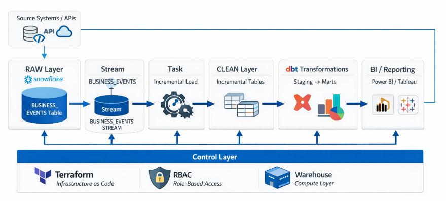
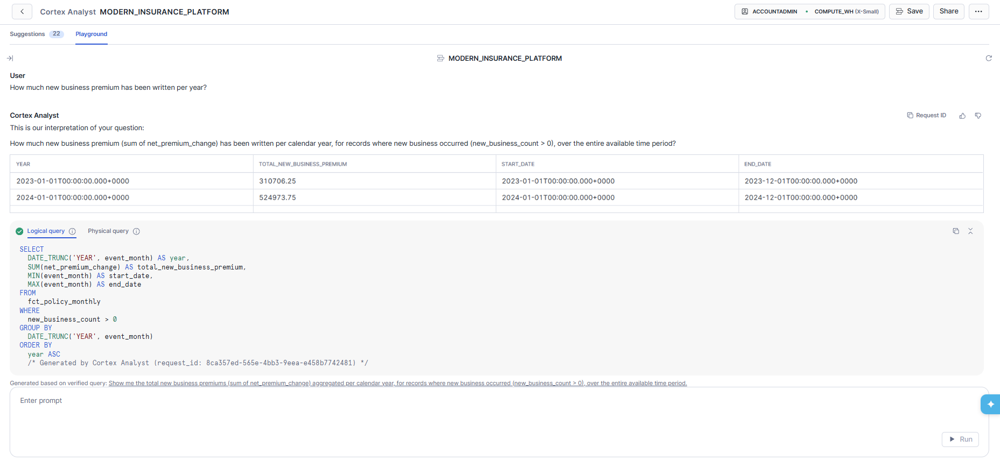

# What I Built: A Modern Insurance Data Platform End to End

This is the more detailed companion piece to the shorter LinkedIn post.

Over the last little while, I’ve been building a modern insurance data platform from the ground up to show how raw operational data can be turned into something structured, trustworthy, and genuinely useful for reporting and analytics.

This has mainly been a learning project for me. I wanted to spend some time going deeper in a few areas where I know there are still gaps in my knowledge, while also pulling together a full end-to-end build that reflects how I think a modern analytics platform could look. I took a step back and asked myself a simple question: if I were starting from scratch in a greenfield insurance environment, how would I build it while keeping the first iteration simple and practical? This project is my first answer to that.

It is also deliberately only a first iteration. I wanted to get something real built quickly end to end, make it available on GitHub so people can explore it and experiment with it, and create a base that I can keep improving over time. There are plenty of areas I want to strengthen from here, but that is part of the point. I wanted something practical, visible, and honest about where it is today and where it can go next.

## GitHub Repository

https://github.com/gwhitnell/modern-insurance-platform

## The Idea

At the centre of the project is Snowflake, with dbt handling transformations and Terraform managing the infrastructure. I designed the platform around a layered structure:

- `RAW` for ingested source data
- `CLEAN` for standardised and typed models
- `ANALYTICS` for business-ready dimensions and facts

That separation was important to me because it keeps the platform easy to reason about and much more maintainable as it grows. At a high level, the job of the platform is simple: take raw insurance data across customers, policies, claims, and business events, and turn it into something that is usable for reporting, analysis, and decision-making.

## What I Built

I didn’t just focus on the transformation layer, I also built out the infrastructure side properly. Using Terraform, I provisioned the Snowflake warehouse, schemas, development and production databases, and role-based access structure. That gave the whole project a much stronger engineering foundation and made it feel like a real platform rather than just a collection of queries.

I also worked on making the data pipeline more realistic. In the staging layer, I standardised messy source fields, handled mixed date formats, cleaned premium and paid amount values, and normalised key categorical columns. That part of the work is easy to overlook, but it is what makes the downstream models usable and trustworthy.

From there, I built out the analytics layer with both dimension and fact models. I created a customer dimension with deduplication logic to form a lightweight golden record, a policy dimension to connect policies back to customers, and fact models for claims, business events, and monthly policy performance.

The monthly policy model is probably one of the clearest examples of the business value in the project. It rolls activity up to a policy-month level and brings together quotes, new business, renewals, mid-term adjustments, cancellations, lapses, premium movement, claim counts, and paid claims in one place. That creates a foundation for looking at sales trends, retention behaviour, customer activity, and claims performance over time.

I also wanted the demo data to tell a story rather than just populate tables. So I seeded production-style data across 24 months with growth in sales, increasing digital acquisition, renewals, policy changes, cancellations, lapses, and claims. That makes the final reporting layer much more meaningful because it supports trend analysis and gives the visuals a realistic narrative.

One of the biggest takeaways from building this was how valuable it is to connect infrastructure, data modelling, and business reporting into one coherent flow. It is one thing to clean a dataset. It is another to design the platform, control access, model the business properly, and then surface it in a way that decision-makers can actually use.

It also gave me a chance to experiment with Snowflake Cortex Analyst and Snowflake Intelligence as an alternative way of answering business questions alongside more traditional self-serve BI.

## Why I Built It This Way

Another part of the project that mattered to me was making it available on GitHub so people can actually explore it, experiment with it, and play with it themselves. Git was not just a storage location here, it was part of the technology stack and the way I wanted the work to be shared. I like the idea of this being something open enough for others to inspect, learn from, and build on.

I also think it is worth saying that this came together in next to no time compared with how long a project like this could easily take. Modern LLM tools like Codex / Claude definitely helped accelerate parts of the build, but the architecture, decisions, and direction were still mine. Used well, those tools can meaningfully increase the speed of execution.

For anyone who has seen my recent post about leaving my last role, you will know I have a bit of space at the moment to reset, recharge, and spend time on projects like this. Part of that is personal learning, part of it is staying sharp, and part of it is using the time well as I look toward the next role. I wanted to create something that reflects how I think about modern data engineering and the kind of work I enjoy building.

That was really the point of this project for me. I wanted to show how I think about building across the full stack of modern analytics engineering:

- Infrastructure as code with Terraform
- Cloud data warehousing in Snowflake
- Transformation and modelling in dbt
- Business-focused fact and dimension design
- Incremental processing patterns
- Reporting-ready outputs for BI tools like Power BI
- AI Experimentation with Cortex Analyst and Snowflake Intelligence

## What Comes Next

Looking back, I’m really happy with how much this project pulled together. It gave me the chance to work across platform design, data quality, dimensional modelling, and analytics storytelling in one end-to-end build. More than anything, it helped me demonstrate how modern data engineering can support real business questions, not just technical outputs.

The GitHub version is there as a starting point, not a finished product. I fully expect to improve most areas of the project over time, whether that is testing, orchestration, monitoring, documentation, reporting depth, or how far I push the production-style design. But I would always rather share a strong first iteration and keep building from there than wait for a version that feels perfectly finished.

If I were taking this straight into the next iteration, I would focus first on stronger test coverage, better production-style data, orchestration and monitoring, improved documentation, and more operational and executive-style dashboards. I would also keep exploring where AI-driven analytics can add real value.

## LinkedIn Post

I’ve spent some time recently building a modern insurance data platform from scratch to turn example raw insurance data into something more structured and useful for reporting, analysis, and decision-making.

This started mainly as a learning project, but also as a way of asking myself a bigger question: if I were building an insurance analytics platform from scratch in a greenfield environment, how would I do it?

So I built my first answer to that.

At a high level, it brings together customer, policy, claims, and business activity data and turns it into something structured and usable for reporting, analysis, and decision-making.

I used Snowflake, dbt, Terraform, SQL, Git, Power BI, Snowflake Intelligence, and Cortex Analyst to build the first iteration.

I’ve also made it available on GitHub so people can explore it, experiment with it, and follow how it develops.

It is intentionally only a first iteration. There is still plenty I want to improve, but I would rather share something real and keep building on it than wait for it to feel finished.

With a bit of time I have had recently to reset and think about what I want to build next, projects like this have been a great way to keep learning, stay sharp, and show the kind of work I want to keep doing in my next role.

It also came together quickly, with parts of the build accelerated by tools such as Codex / Claude. The direction and design were mine, but the speed these tools now enable is hard to ignore.

I’ve included the high-level architecture below, and more detail on the project and code is available on GitHub: https://github.com/gwhitnell/modern-insurance-platform

Thanks all and will keep you updated on my next move shortly....
